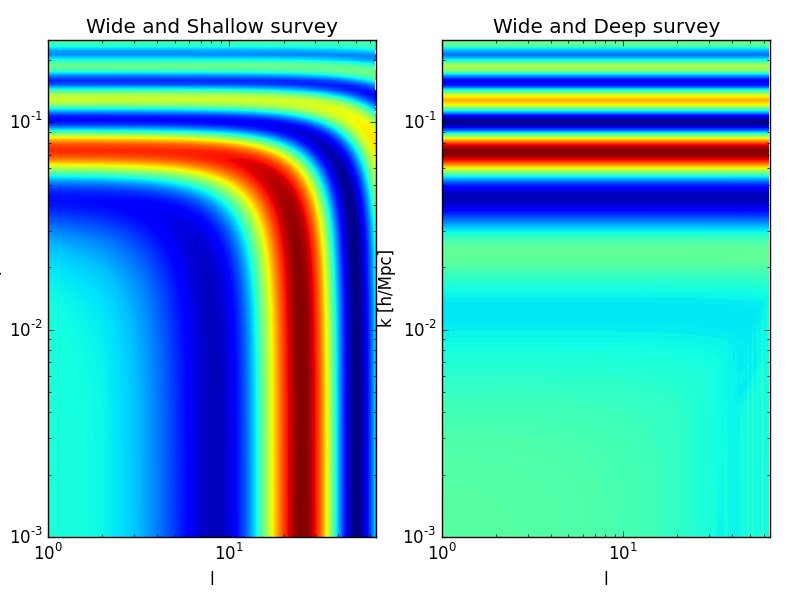
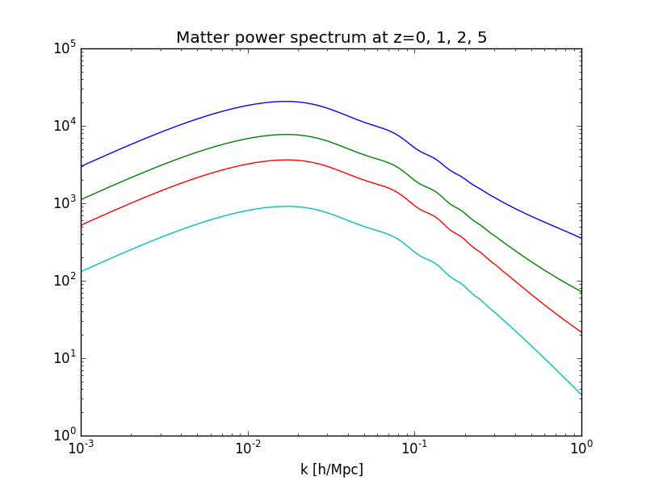
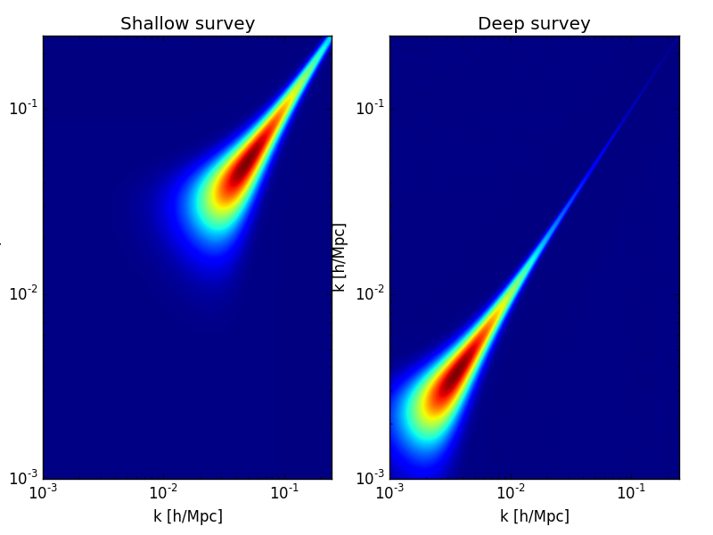

.. Copyright (c) 2014-2015, CosmicPy Developers
.. Licensed under CeCILL 2.1 - see LICENSE.rst
Welcome to CosmicPy
===================

CosmicPy is an Python package which allows for simple and interactive cosmology
computations. Designed to be modular, well documented and easily extensible,
CosmicPy aims to be a convenient tool for forecasting cosmological parameters
constraints for different probes and different statistics.

Here are some of the features of CosmicPy:

* Completely open package, with collaborative development in mind
* Extensive documentation of the Python code and detailed tutorials
* Tomographic angular power spectra
* Spherical Fourier-Bessel power spectra, with fast Bessel computation through a C++ library
* Tomographic and Spherical Fourier-Bessel Fisher matrices for galaxy clustering

Contents
--------
.. toctree::
    :maxdepth: 2

    install
    tutorials/index
    cosmicpy/index
    developer/index
